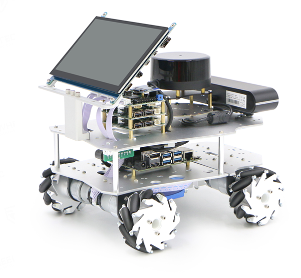
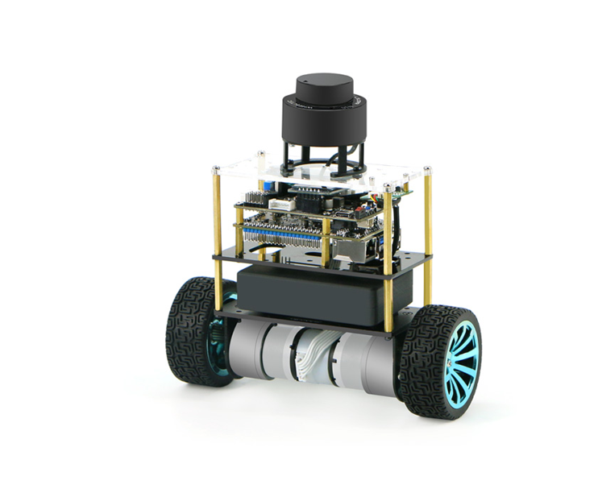

# WHEELTEC ROS 机器人产品介绍
## 麦轮车R550产品介绍

​        R550是轮趣科技面向ROS教育入门场景的旗舰产品，融合了轮趣科技7年底盘技术和3年的ROS视频教程积累，把教学性能、性价比、品质做到了非常理想的状态。R550提供了多种底盘可选和源码级的视频教程（非演示教程），搭载轮趣科技的战略伙伴提供的高性价比雷达和深度相机等配件，可满足建图导航、深度学习、3D视觉、机器人编队等方向的学习。提供技术支持，可以满足零基础入门和提高。

轮趣科技也为有需要的开发者们提供了配置好相应环境的开源镜像

麦轮车R550 ROS1镜像链接：

链接:  [https://pan.baidu.com/s/1TIbvILUxG0UG7X7Gv0B1fQ](https://pan.baidu.com/s/1TIbvILUxG0UG7X7Gv0B1fQ)

提取码: xsax

R550 ROS2镜像链接：

链接：https://pan.baidu.com/s/1uxw4a6eRZPyh0qiLcA-AFg

提取码：s112

手册内容以ROS1使用及适配为主，ROS2使用请参照我司其他相关资料。

## 智能平衡车B585产品介绍

​        智能平衡车B585为轮趣科技经典产品平衡小车的高配版本，使用高性能平衡小车底盘，配备自有专利的GMR高精度编码器，兼容PID速度位置闭环控制学习，提供数学建模供开发者进行深入研究学习，同时具备姿态识别技术，可根据算法判断小车状态从而自动开启或关闭平衡系统，搭载激光雷达可实现避障跟随等功能，搭载ROS主控还可实现建图导航功能，可满足平衡控制方向开发者的使用需求。

该产品同样配备已配置好相应环境的开源镜像

智能平衡车B585 ROS1镜像链接：

链接:  [https://pan.baidu.com/s/1VGJLFjag2uLk5bjHNbpH-A](https://pan.baidu.com/s/1VGJLFjag2uLk5bjHNbpH-A)

提取码: drpq
