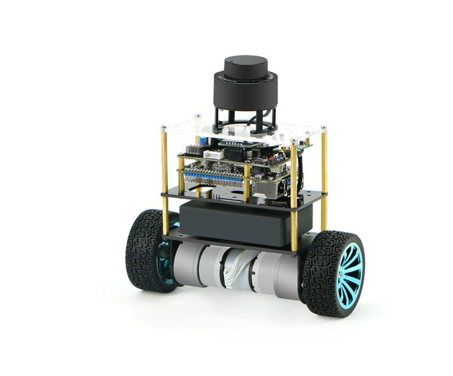

## 智能平衡车B585产品介绍

​        智能平衡车B585为轮趣科技经典产品平衡小车的高配版本，使用高性能平衡小车底盘，配备自有专利的GMR高精度编码器，兼容PID速度位置闭环控制学习，提供数学建模供开发者进行深入研究学习，同时具备姿态识别技术，可根据算法判断小车状态从而自动开启或关闭平衡系统，搭载激光雷达可实现避障跟随等功能，搭载ROS主控还可实现建图导航功能，可满足平衡控制方向开发者的使用需求。

该产品同样配备已配置好相应环境的开源镜像

智能平衡车B585 ROS1镜像链接：

链接:  [https://pan.baidu.com/s/1VGJLFjag2uLk5bjHNbpH-A](https://pan.baidu.com/s/1VGJLFjag2uLk5bjHNbpH-A)

提取码: drpq