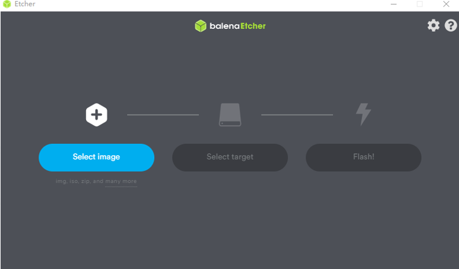
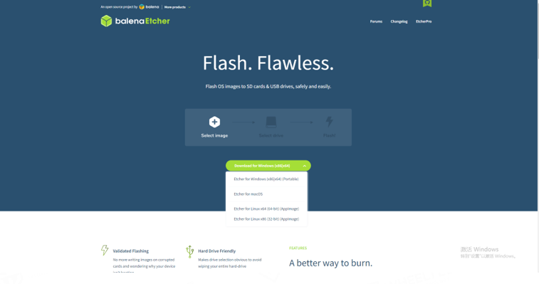
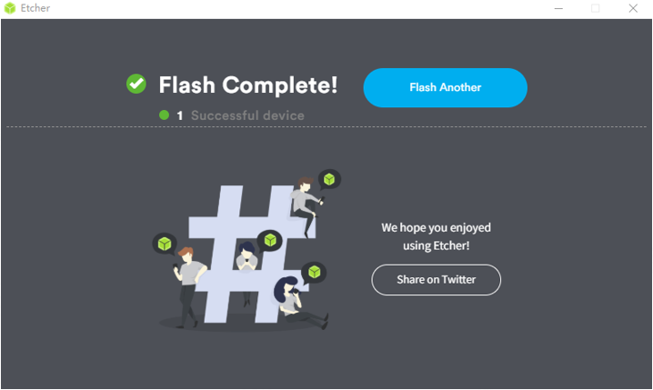

## 鲁班猫1S镜像的烧录

烧录准备：

> Windows系统、需要烧录镜像的SD卡、读卡器	

软件工具：

> SD卡格式化工具、镜像烧录工具：balenaEtcher

首先我们要做的准备工作有：空的SD卡（如何格式化SD卡可参阅【③格式化SD卡】）、读卡器（用3.0的读卡器会快很多也比较稳定）、32G/64G镜像文件（镜像可联系原购买渠道获取）。

我们现在最新版本的镜像文件是32G的，可使用32G/64G的SD卡进行烧录。使用的工具是balenaEtcher，关于它的获取我们提供了当前最新版的1.78版本软件。

或者我们可以在balenaEtcher烧录工具的官方网站下载

下载地址：https://www.balena.io/etcher/

balenaEtcher烧录工具分为windows、macOs和linux系统。大家可以根据自身需求下载对应的系统软件。

烧录步骤：

1. 打开balenaEtcher工具，点击[Select image]选择镜像所在路径 （注意：烧录时选择的镜像文件格式为.gz压缩文件，压缩文件不需要手动解压，烧录过程中会自行解压。）
2. 点击[Select target]选择SD卡所接入的读卡器设备。
3.   点击[Flash!] 进行烧录。

等待烧录完成之后，界面显示Flash Complete！，拔出我们烧录完成的SD卡，便可以直接插在小车上正常使用啦。

