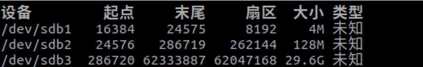
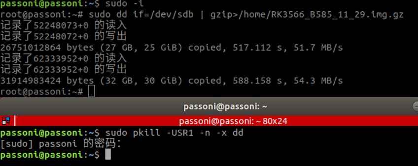
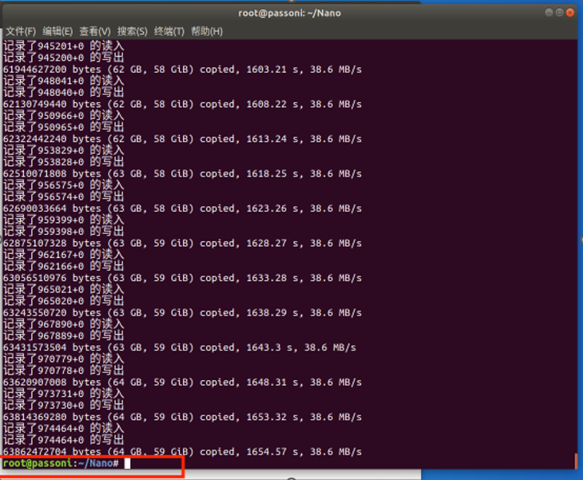
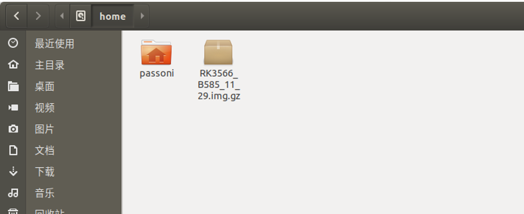

# 鲁班猫1S镜像的备份


首先我们要做的准备工作有：


> 含有镜像的SD卡、读卡器、安装了ubuntu环境的电脑。


备份步骤：

把含有镜像的卡用读卡器接到硬盘剩余空间大于30G的Ubuntu系统上，建议使用装有ubuntu系统的电脑，虚拟机备份存在备份失败的可能性。

备份过程为:

1. 首先打开一个终端输入命令 “sudo fdisk -u –l” 查看SD卡所在磁盘分区；

2. 在备份的路径目录下打开终端使用命令  “sudo -i”进入root模式准备备份

   例如我准备备份在/home 路径下

3. 主目录下打开终端输入命令开始备份：

```
    sudo dd if=磁盘分区 | gzip > /home/镜像文件名.img.gz
```
   例如我这里的SD卡所在磁盘分区为/dev/sdb，镜像文件名是RK3566_B585_11_29，镜像格式为.img.gz格式。

   


```
    sudo dd if=/dev/sdb | gzip -c > /home/RK3566_B585_11_29.img.gz

```
   

4. 备份过程可以新打开一个终端使用命令:

   
```
    sudo pkill -USR1 -n -x dd
```
   

   查看一次当前进度，或者使用命令:
```
    sudo watch -n 5 pkill -USR1 -n -x dd 
```
   定时5秒刷新一次当前进度。

   备份完成后会弹出输入栏如下图所示：



备份完成后的镜像文件



这时便可以将备份的镜像文件直接用U盘直接拷贝出来进行其它操作使用了。