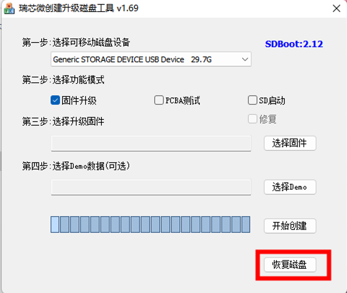

# 格式化SD卡

​       使用读卡器将sd卡接入Windows系统，建议先使用软件进行格式化，该软件在我们的资料下载链接中提供

然后使用cmd命令再次进行格式化，具体操作步骤如下：

1. 在windows的cmd界面输入diskpart
2. 查看磁盘： list disk
3. 选中内存卡所在的磁盘（29GB 此处以disk 3为例） ：select disk 3
4. 输入清除命令:clean