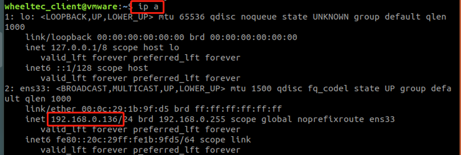
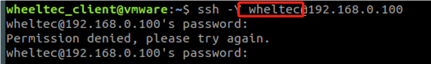

# 机器人与PC端建立多机通信操作说明

​        如果想通过PC端远程控制的方式实现ROS机器人产品的功能，我们就需要对产品和PC端进行多机通信配置，通常我们使用的方法是由ROS主控发出热点，PC端开启Windows虚拟机连接该热点来实现多机通信，即ROS主控作为主机，虚拟机作为从机。要实现多机通信，我们就需要确认主从机的ip地址，并在.bashrc文件中进行配置。主控与虚拟机的成品镜像已默认完成该部分配置，若使用我们所提供的成品镜像，可跳转到本节第4小节开始进行机器人功能使用。

虚拟机镜像链接：

链接: [https://pan.baidu.com/s/1Wgghv7fsIopfga7iC4IxkA](https://pan.baidu.com/s/1Wgghv7fsIopfga7iC4IxkA)

提取码: 3kc5

##  确认主机端（ROS机器人）IP地址

由ROS主控发出热点时，ROS机器人为主机，首先需要使用ip a指令查看主机IP地址


可得主机的IP地址是192.168.0.100，这是因为我们的ROS机器人配置为热点模式时已经固定好了IP地址。


## 主机端（ROS机器人）.bashrc文件配置

在主机的.bashrc文件中，我们需要对主机及从机的IP地址进行配置，ROS_MASTER_URI为主机IP地址，只有主机可以启动roscore，而ROS_HOSTNAME需设置为当前设备（此处为主机）的IP地址，否则无法与其它设备进行ROS通信。.bashrc文件为隐藏文件，可使用Ctrl+H在文件管理器中显示隐藏文件或用文本编辑器编辑的方式查看，这里我们使用gedit方式打开


可查看得小车默认的.bashrc文件配置如下


因为将小车作为ROS主机，因此这里ROS_MASTER_URI与ROS_HOSTNAME均为小车默认固定的IP地址192.168.0.100，配置完.bashrc文件后，需要运行source .bashrc使更改生效：


注意source命令只对当前及后面打开的终端有效，如开启几个终端后再更改.bashrc文件时，需要对所有已打开的终端都运行一遍source命令或打开新的终端配置才会生效。


## 确认从机端（虚拟机）IP地址

当ROS主机发出热点由PC端虚拟机来进行连接时，虚拟机就作为从机，首先查看虚拟机IP地址：





虚拟机的IP地址为192.168.0.136，这是因为我们也对虚拟机的IP地址进行了固定。

## 从机端（虚拟机）.bashrc文件配置

虚拟机.bashrc文件查看配置方式同ROS机器人


前面我们已经查看到主机端（ROS机器人）默认热点IP地址为192.168.0.100，同时虚拟机静态IP地址默认固定为192.168.0.136，ROS_MASTER_URI为主机IP地址，因此设置为192.168.0.100，而ROS_HOSTNAME为当前设备的IP地址，即虚拟机IP地址192.168.0.136。

## SSH登录

输入远程登录指令ssh -Y wheeltec@192.168.0.100，这里-Y的目的是远程运行图形应用，如果不需要运行图形应用也可以不加-Y。在SSH登录时，我们可能会碰到图中显示的问题，这是由于当前使用的主控与之前所远程登录使用的主控不同，只需要复制终端所提示的ssh-keygen这一行内容后重新进行登录即可。


这里我们可以注意到，登录前终端的用户名为wheeltec_client，这代表的是虚拟机端


而登录后，终端用户名变为wheeltec，这代表我们已经成功登陆到小车端，可以在此运行小车工作空间的文件


## SSH无法远程登录的解决方法

如果无法进行远程登录的话，有两种可能性：用户名错误或虚拟机配置错误。


我们小车的用户名是wheeltec，ssh登录指令为：ssh[空格]用户名@ROS主机IP地址，如果用户名错误或IP地址不对应都可能造成远程登录失败。



虚拟机配置错误的解决方法首先是查看虚拟机的网卡设置，首先我们可以在电脑连接网络处查看连接小车所使用的网卡，连接小车WiFi后点击属性


进入WiFi属性页面，在下方描述处可看到连接该WiFi所使用的网卡


进入虚拟机，在虚拟机左上角找到编辑，点击虚拟网络编辑器


对应的虚拟机选择桥接模式，并在下方“已桥接至”处选择正确的网卡


接着可以查看对应的虚拟机是否处于桥接模式，在左侧栏内右键选中使用的虚拟机，点击设置


选择网络适配器，右侧网络连接处选择桥接模式


设置为桥接模式后，才能进行远程登录。


## NFS挂载


NFS(Network File System)即网络文件系统，它允许网络中的计算机之间共享资源。在NFS的应用中，本地NFS的客户端应用可以透明地读写位于远端NFS服务器上的文件，就像访问本地文件一样。


我们可以通过使用NFS挂载的方式将主机端的文件挂载到客户端（此处为从机端即虚拟机），实现在虚拟机对主机端的源码进行查看修改等。


在客户端（此处为虚拟机）运行命令行：
```
 sudo mount -t nfs 192.168.0.100:/home/wheeltec/wheeltec_robot  /mnt
```


这里的命令行是将主机端的工作空间挂载到了/mnt路径下，因此我们要通过打开这个路径的方式来查看其中挂载的文件。查看挂载文件可以直接在虚拟机的文件系统进行查看，首先点击左侧的文件


点击其他位置，选择计算机进入系统根目录


进入根目录后，我们可以看到很多的文件夹，打开所挂载的mnt文件夹


进入mnt路径下，可以看到主机工作空间已经成功挂载，想要查看或修改功能包的源码可以查看其中的src文件夹


还可以使用Sublime Text编辑器查看主机端的文件，我们依旧是要在Sublime Text中打开mnt文件夹来查看主机端的文件，选择文件→打开文件夹，然后选择根目录下的mnt文件夹打开，我们就可以在Sublime Text中查看主机端的文件并做修改了。


