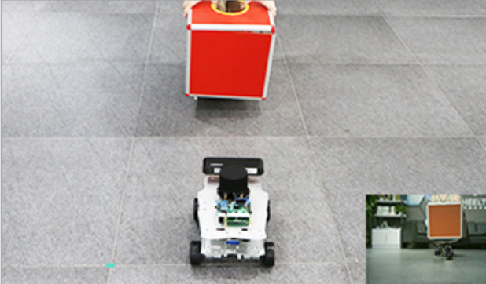
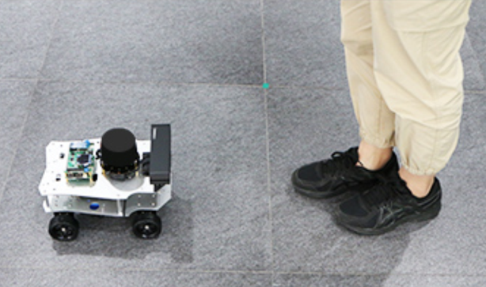
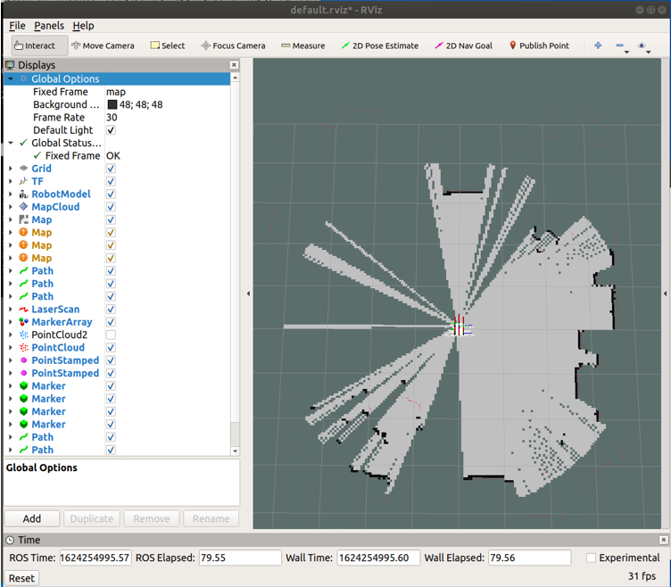
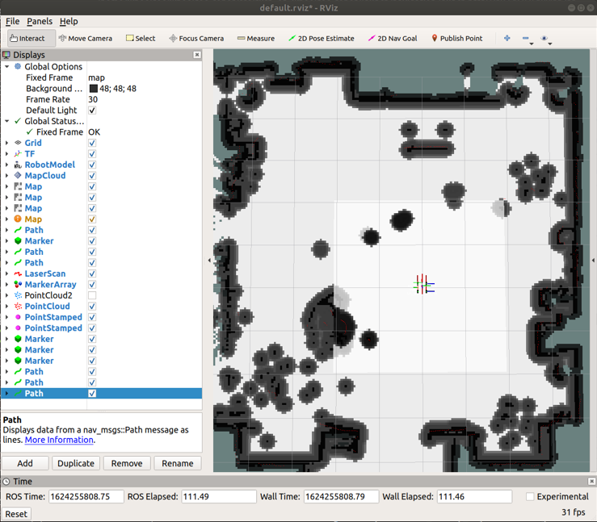

# 产品功能操作说明

因为我们镜像默认设置为由ROS主控发出热点，PC端连接该热点来实现多机通信，所以下文中主机端为ROS主控端，即SSH登录后的终端，从机端为PC端虚拟机，即在虚拟机本地打开的终端。

## 视觉跟随功能（B585无视觉传感器，不支持此项）





视觉跟随是实现ROS机器人对目标颜色的物体进行跟随。


在主机端运行命令行：


```
   roslaunch simple_follower visual_follower.launch 
```


执行完命令之后，小车开始寻找目标物体。默认情况下，小车视觉跟随目标为红色物体，小车会通过目标物体的位置进行相关计算获得运动速度，从而实现对目标物体的跟随。


## 雷达跟随功能





雷达跟随功能利用激光雷达360°实时扫描特性，寻找周围可检测到的最近的物体，并对其进行跟随。


在主机端运行命令行：


```
   roslaunch simple_follower laser_follower.launch
```


雷达跟随启动后，小车会不断寻找雷达扫描范围内距离最近的目标，之后找到一个距离最近且合理的目标进行跟随，最终与被跟随物保持适当的距离（即所设置的中距值），车头正对被跟随物体（即小车与被跟随物体之间夹角为0°）。


## 建图功能

2D建图功能通过激光雷达来实现SLAM建图，扫描所得地图为2D平面效果。

该功能需要开启两个远程登录到主机端的终端。

在主机端运行命令行：


```
   roslaunch turn_on_wheeltec_robot mapping.launch
```


可通过多种控制方式控制机器人移动完成建图，此处以ROS键盘控制方式为例：

在主机端运行命令行：


```
   roslaunch wheeltec_robot_rc keyboard_teleop.launch
```


使用ROS中的可视化工具Rviz可对建图效果进行查看，

在从机端（虚拟机）运行命令行：
```
   rviz
```
效果示例如下：





建图完成后，需对所建地图进行保存。

在主机端运行命令行：


```
   roslaunch turn_on_wheeltec_robot map_saver.launch
```


## 导航功能

2D导航功能通过激光雷达来实现SLAM导航，使用2D建图功能所保存地图来进行。

在主机端运行命令行：


```
   roslaunch turn_on_wheeltec_robot navigation.launch 
```


同样使用ROS中的可视化工具Rviz对导航效果进行查看，

在从机端（虚拟机）运行命令行：
```
   rviz
```
效果示例如下：




导航模式有两种：

一种是单点导航，点击rviz上方2D Nav Goal按键，然后在地图中选定导航点与方向，单击鼠标确定导航目标点位置，并且不要松开，继续拖动选择导航目标方向，确定后松手，小车就会运动到所指定的目标点，在运行rviz的终端也会显示目标点的坐标；

另一种是多点导航，点击rviz界面上方的Publish Point设置用于多点导航的点，当设置多个点时，小车会在这几个点之间往复运动，注意使用Publish Point工具进行多点导航时，所设置的导航点默认方向都是小车的初始车头方向。

