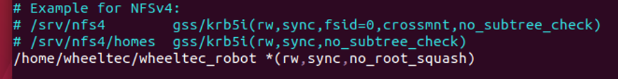
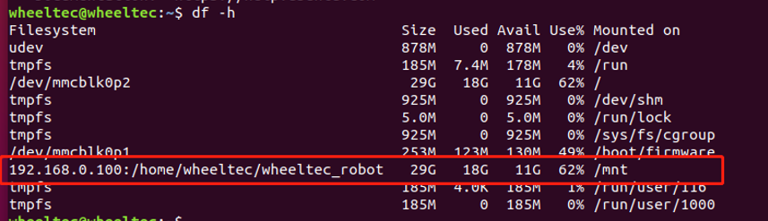

# NFS远程挂载配置

## NFS服务端配置

首先需要服务端将自己的文件挂载出来，然后才能被客户端访问。以下的步骤都是在服务端（ROS主机）执行。

A.安装NFS服务端：

> sudo apt-get install nfs-kernel-server

B.添加NFS共享目录（要挂载的文件夹）：

> sudo vim /etc/exports

在文末添加以下指令后保存退出，这个指令前面是要挂载的文件路径，*表示允许任何网段IP的系统访问该NFS目录。

> /home/wheeltec/wheeltec_robot *(rw,sync,no_root_squash)

C.给挂载的目录设置权限以及修改文件用户：

> sudo chmod  -R 777 /home/wheeltec/wheeltec_robot

> sudo chown -R 777 /home/wheeltec/wheeltec_robot

因为“wheeltec_robot”文件夹有子文件夹，在命令中添加“-R”是说明命令的作用域包括该文件夹和其包括的全部子文件夹。

D.启动NFS：

第一次开启NFS时，需要先启动NFS再重启NFS。

> sudo /etc/init.d/nfs-kernel-server start

> sudo /etc/init.d/nfs-kernel-server restart

接下来检查服务端有没有配置、开启成功：

E.挂载NFS：

将本地的/home/wheeltec/wheeltec_robot路径挂载到本地/mnt路径下，“192.168.0.100”是服务端的IP地址。

> sudo mount -t nfs -o nolock 192.168.0.100:/home/wheeltec/wheeltec_robot  /mnt

F.查看是否挂载成功：

可以直接打开/mnt目录查看里面的内容是否/home/wheeltec/wheeltec_robot目录相同，或者直接使用指令df -h查看所有挂载的项目。

## NFS客户端配置

挂载是在客户端（此处为从机端）实现的，因为客户端无法直接查看小车工作空间中的文件，需要通过NFS把服务端的文件挂载到客户端后，客户端才可以查看和编辑服务端的文件。NFS客户端只需要安装即可自动配置完成。

安装NFS客户端：

> sudo  apt-get  install  nfs-common 

## NFS挂载使用

此处与前文3.2小节 NFS挂载部分内容一致，不再重复，可参照前文。