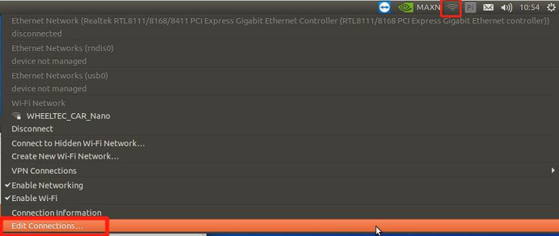

# 网络连接与静态IP配置

通常我们使用由ROS主控发出热点，PC端连接该热点的方式来实现多机通信的，即ROS主控作为主机，PC端作为从机。若要实现多机通信，就需要先进行网络连接设置与静态IP配置。

首先将机器人产品连接显示屏，在右上方找到WiFi图标，点击Edit Connection

点击左下角加号新建一个连接（另外，可以选中任一连接后点击减号，以删除所选连接，留下用户自己所需的连接）

新建连接类型选择WiFi

首先是WiFi选项卡，在SSID处设置WiFi名称，Mode处选择Hotspot创建热点

WiFi安全性选项卡中主要是设置加密类型和密码，用户可以自行选择，通常选用WPA&WPA2类型

IPv4选项卡主要是IP地址的设置，这里就是我们固定IP地址的地方，依次输入要设置的IP地址、子网掩码和网关

IPv6地址选择忽略后电机右下方保存，热点就创建完毕了

若想要切换到我们刚刚所创建的热点，依旧点击右上方WiFi图标，选择Disconnect

再点击connect to hidden Wi-Fi network

在connection处选择要连接的连接名，注意此处选择的不是WiFi名，是在刚刚创建窗口中最上方的connection name

点击连接后重新点击WiFi图标，可以看到已经连接到了刚刚所创建的热点

